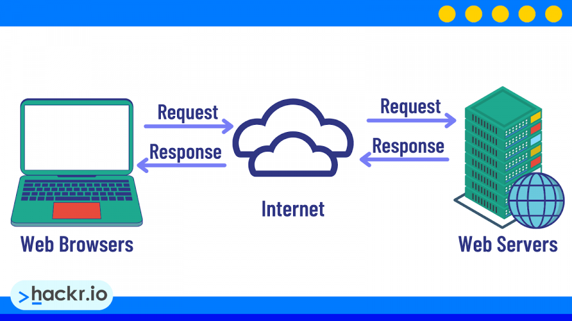
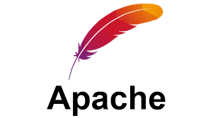
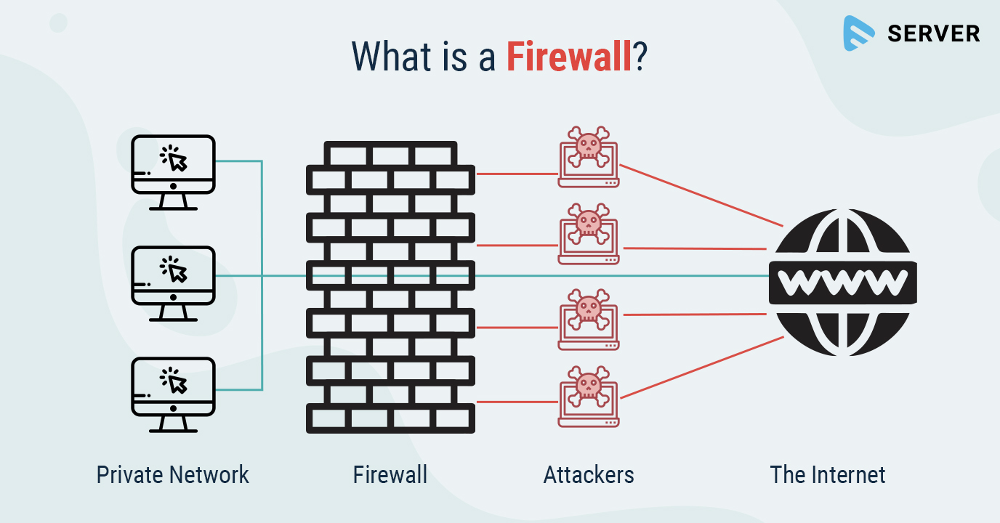

# Deliverable 1 

## Questions

### 1. What is a web server?
   * In the context of software, a web server is a program that runs on a computer to handle requests from web browsers and deliver website content. It uses the Hypertext Transfer Protocol (HTTP) to listen for requests, find the requested files (like HTML, images, and CSS), and send them back to the user's browser. Examples of web server software include Apache, Nginx, and LiteSpeed.

### 2. What are some different web server applications? 
   1. Nginx
       *  Definition: Nginx (pronounced "engine-x") is an open-source web server known for its high performance, stability, and low resource consumption. It's often used as a reverse proxy, load balancer, and mail proxy in addition to being a web server. It excels at handling a massive number of simultaneous connections with minimal memory usage.
       *  Project Website / Download: `https://nginx.org (Open Source) / https://www.nginx.com` (Commercial version, Nginx Plus)
       *  Supported OS: Linux, BSD variants, macOS, Windows, IBM AIX, and other Unix-like systems.
       *  Latest Stable Version: 1.25.3 (as of October 2023, but check the website for the most current version).

   2. Apache HTTP Server
       *  Definition: Often called simply "httpd" or "Apache," this is one of the oldest and most reliable web servers, powering a significant portion of the internet for decades. It's highly modular, allowing extensive customization through its Dynamic Shared Object (DSO) system. Its module ecosystem is vast and mature.
       *  Project Website / Download: `https://httpd.apache.org`
       *  Supported OS: Linux, Windows, macOS, BSD, and virtually all Unix-like operating systems.
       *  Latest Stable Version: 2.4.58 (as of October 2023, but check the website for the most current version).

### 3. What is Virtualization?
   * Virtualization is the process of creating a software-based (or "virtual") representation of something, rather than a physical one. The most common form is Hardware Virtualization, which involves using a software layer (called a hypervisor) to create and run multiple simulated computer environments (called virtual machines or VMs) on a single physical machine.
    * Virtualization is a technology that allows you to break the rigid "one machine, one operating system" model. It lets you decouple software from hardware, creating flexible, efficient, and resilient IT environments that form the foundation of the modern cloud.

### 4. What is VirtualBox?
   *  VirtualBox is a specific, popular application that puts the concept of virtualization into practice for everyday users and developers. 
   * VirtualBox is a free and open-source Type 2 Hypervisor (or hosted hypervisor) developed by Oracle. In simple terms, it's a program that allows you to install and run multiple "virtual computers" inside your actual physical computer.
   * Each of these "virtual computers" is called a Virtual Machine (VM), and it runs its own operating system and applications as if it were a separate, physical machine.
   * VirtualBox is a powerful, free tool that lets you create and run multiple, isolated virtual computers on a single physical machine. It's an essential tool for developers, IT professionals, and tech enthusiasts who need to run multiple operating systems without the cost and hassle of maintaining multiple physical computers.

### 5. What is Virtual Machine?
   * The simple analogy: A computer within a computer.
   * A Virtual Machine (VM) is a software-based emulation of a physical computer. It's a completely isolated environment that runs its own operating system and applications as if it were a separate physical machine, but it shares the underlying hardware resources of the host computer.

### 6. In the context of virtualization, what does host machine and guest machine mean?
   * In the context of virtualization, the terms "host machine" and "guest machine" are fundamental. They describe the relationship between the physical computer and the virtual ones running on it.
   * The Host Machine is the physical, tangible computer that provides the underlying hardware resources.
   * The Guest Machine is the virtual computer that runs on top of the host machine.
   * In short, the Host is the real thing, and the Guest is the virtual copy that runs on it. You interact with the host machine directly, but you can open a window (the VM console) to interact with the guest machine as if it were its own independent computer.

### 7. What is Debian?
  *  Debian is a highly influential and widely used operating system, known for its stability, reliability, and its commitment to free and open-source software.
  *  Debian (pronounced DEB-ee-an) is a free and open-source Linux distribution. A "distribution" (or "distro") is a complete operating system built around the Linux kernel, bundled with a wide array of software like system libraries, desktop environments, and applications.
  *  In essence, Debian is a rock-solid, versatile, and purely community-driven Linux distribution. It prioritizes stability and free software principles above all else. Its reliability and powerful package management system have made it a cornerstone of the internet and the foundation for a vast ecosystem of other Linux distributions.

  
### 8. What is a firewall?

  * A firewall is a network security system (either hardware or software) that monitors and controls incoming and outgoing network traffic based on predetermined security rules. It acts as a barrier between a trusted, secure internal network and an untrusted external network (like the Internet).
  * In a nutshell, a firewall is a digital security guard that stands between your network and the untrusted internet. It uses a set of rules to filter traffic, allowing good traffic in and keeping bad traffic out, forming a fundamental layer of defense for any connected system.

### 9. What is SSH?
  * SSH, or Secure Shell, is a network protocol that provides a secure way to access and manage a computer over an unsecured network, like the Internet. It creates a strongly encrypted connection between a client (your computer) and a server (a remote computer), ensuring that all communication is private and protected from eavesdropping. 

### 10. What is an IP Adress?
  * An IP Address (Internet Protocol Address) is a unique numerical label assigned to every device connected to a computer network that uses the Internet Protocol for communication.
  * It servers two main purpose:
    * Host or Network Interface Identification: It identifies a specific device on the network.
    * Location Addressing: It provides the location of that device in the network (like a return address on a letter), enabling data to be routed to it.
  * In summory, an IP Address is the unique identifier for a device on a network. It's the foundation of how all devices on the internet find and talk to each other, ensuring that data you request from halfway around the world correctly finds its way back to your screen.

### 11. What is a network mask?
  * A network mask is a 32-bit number used in IPv4 to divide an IP address into two parts:
     * Network Portion: Identifies the specific network a device belongs to.
     * Host portion: Identifies the spesific device within that network.
  * The mask "masks" the network part of the IP address. it's what defines the size of a network.
  
### 12. What is a port? (in the context of networking/computers)
  * In the context of networking, a port is a fundamental concept that works alongside an IP address to ensure data gets to the right application on a device.
  * A port is a virtual, numbered endpoint for a communication channel in an operating system. It is a 16-bit number (ranging from 0 to 65535) used by network protocols like TCP (Transmission Control Protocol) and UDP (User Datagram Protocol) to direct data to the correct software application or service on a single computer.

### 13. What is port forwarding?
  * Port forwarding is a networking technique that allows external devices to access services on a private network. It's a crucial concept for gaming, hosting websites, and remote access. 
  * Port forwarding (also known as port mapping) is a configuration on a network router that redirects a communication request from one IP address and port number combination to another while the packets are traversing a network gateway, such as a router or firewall. This technique is required because of how home networks are set up with Private IP addresses.

### 14. What is localhost? (in the context of networking/computers)
  * localhost is a fundamental concept in networking that refers to the device you are currently using.
  * localhost is a hostname that refers to the current device used to access it. It is used to establish a network connection to the same machine that the user is working on.
  * The loopback mechanism is implemented in the device's network software, and any traffic sent to this address is immediately "looped back" to the same device. It never touches the physical network hardware (like your Ethernet cable or Wi-Fi card).

### 15. What does this ip address represent 127.0.0.1?
  * `127.0.0.1` is the most common and well-known IPv4 loopback address.
  *  Loopback: It's a special reserved address that a computer uses to send network traffic back to itself. Any data packet sent to this address is immediately "looped back" by the operating system's network software and is received by the same computer that sent it. It never leaves the network interface card (NIC) or touches any external network (like your LAN or the internet).
  *  localhost": This IP address is what the hostname localhost typically resolves to. When you type `http://localhost` into your browser, it's functionally identical to typing `http://127.0.0.1`.
  * In the simplest terms, 127.0.0.1 is your computer's internal "call home" address.
  * It's a self-referential address used for testing, development, and running network services locally. It's a fundamental tool that allows a computer to communicate with itself over the network loopback interface, completely independent of any external network connection.n the simplest terms, 127.0.0.1 is your computer's internal "call home" address.

### 16. What is Git?
  * Git is a free, open-source, Distributed Version Control System (DVCS).
  * Version Control System (VCS): It's a system that records changes to a file or set of files over time so you can recall specific versions later. It's like "track changes" in Google Docs or Microsoft Word, but vastly more powerful and designed for source code.
  * Distributed (DVCS): This is the key. Instead of having one central server that holds the history (like Subversion), every developer has a full copy of the entire project history, including all branches and commits, on their own local machine. This makes operations incredibly fast and allows you to work offline.
  *  Git is a version control system that tracks changes in your source code, allowing multiple developers to work together on non-linear projects efficiently. It provides a safety net for your work, enables powerful collaboration, and is an indispensable tool for virtually all professional software development today.

### 17. What is GitHub?
  * GitHub is a platform that builds upon the Git version control system, turning it into a powerful social and collaborative hub for developers.
  *  GitHub is a web-based cloud platform that provides hosting for software development and version control using Git. It adds a graphical user interface, access controls, and powerful collaboration features on top of the core Git functionality.
  * GitHub is a social networking site for programmers and their code.
  * In a nutshell, GitHub is a cloud-based platform that supercharges the Git version control system by adding a web interface, powerful collaboration tools, and a social community. It's where developers store their code, track issues, manage projects, and collaborate with millions of other developers on everything from hobby projects to the world's most important software.