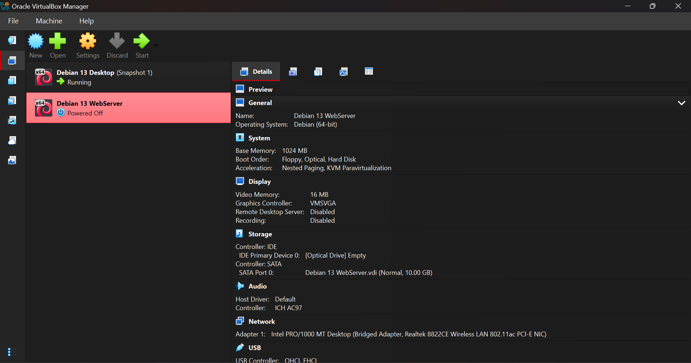
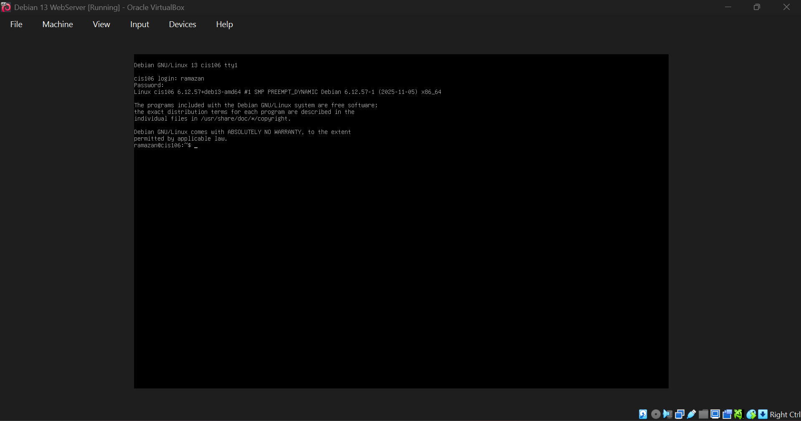
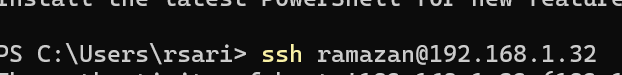

# Deliverable 2 

## Questions

### 1. What are the server hardware specifications (virtual machine settings)?

### 2. What is the Debian Login Screen?

### 3. What is the IP address of your Debian Server Virtual Machine?

### 4. How do you work with the Firewall in Debian?
   -  Working with Firewall in Debian
      -  Description: A user-friendly interface for managing iptables firewall rules in Debian and other Linux distributions.
         -  Formula/Syntax: `sudo ufw [options] [rule]`
   - Examples:
   1. How do you check if the Firewall is running?
   - Command: `sudo ufw status`
   - Explanation: Shows firewall status (active/inactive) and current rules. 
  2. How do you disable the Firewall?
   - Command: `sudo ufw disable`
   - Explanation: Stops the firewall and prevents it from starting at boot. 
   3. How do you add Apache to the Firewall?
   - Command: `sudo ufw allow 'Apache Full`
   - Explanation: Allows traffic on both HTTP (port 80) and HTTPS (port 443) for Apache.
### 5. What different commands do we use to work with Apache?
    1. Check if Apache is running:
       - Command: `sudo systemctl status apache2`
    2. Stop Apache:
       - Command: `sudo systemctl stop apache2`
    3. Restart Apache:
       -  Command: `sudo systemctl restart apache2`
    4. Test Apache configuration:
       - Command: `sudo apache2ctl configtest`
    5. Check installed Apache version:
       - Command: `apache2 -v`
    6. Common Apache configuration files:
       - `/etc/apache2/apache2.conf` (Main config)
       - `/etc/apache2/sites-available/` (Virtual host configurations)
       - `/etc/apache2/conf-available/` (Additional configurations)
    7. Apache log locations:
       - Acess logs: `/var/log/apache/access.log`
       - Error logs: `/var/log/apache2/error.log`
    8. Basic log review commands: 
       -  `sudo tail -f /var/log/apache2/access.log` (Real-time monitoring)
       -  `sudo grep "ERROR" /var/log/apache2/error.log` (Filter errors)
       -  `sudo less /var/log/apache2/error.log` (Page-by-page viewing)