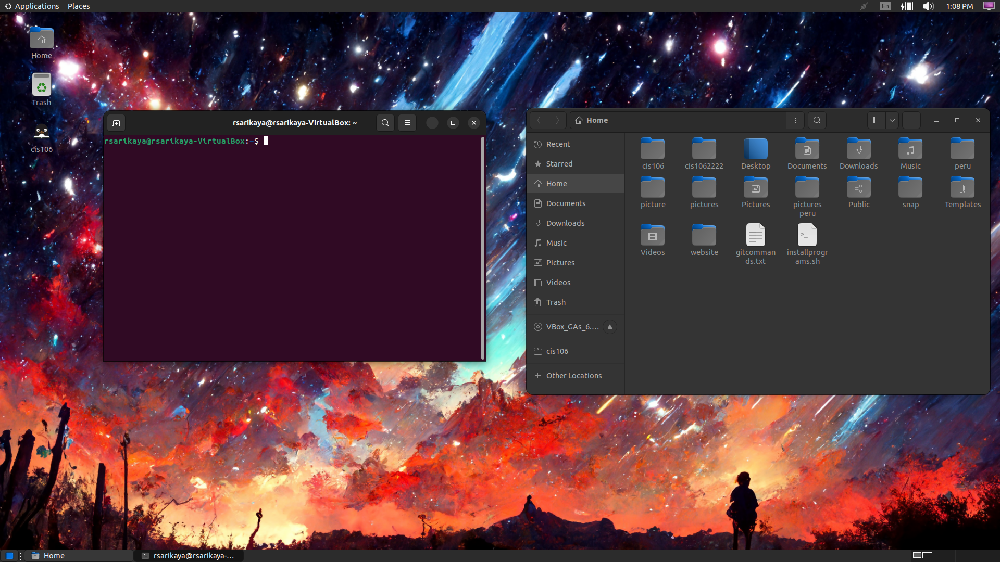

# Lab 3 Submission 

## Question 

## Question 2

| Program purpose     | Package Name     | Version                  |
| ------------------- | ---------------- | ------------------------ |
| Play a tetris game  | blockattack      | 2.7.0-1 amd 64           |
| Play a video file   | dragonplayer     | 4:21.12.3-0ubuntu1 amd64 |
| Browse the internet | epiphany-browser | 42.4-0ubuntu1 amd64      |
| Read your email     | gearcy           | 40.0-2 amd64             |
| Play music          | gmpc             | 11.8.16-19 amd64         |

## Question 3

1. Install the programs that you found using a single command. Which command did you use?
- sudo apt install blockattack dragonplayer epiphany-browser geary gmpc -y

2. Remove all the programs that you installed in a single command. Which command did you use?
- sudo apt remove blockattack dragonplayer epiphany-browser geary gmpc -y

3. If you were to install the first and second program, but remove the other 3 in a single command, Which command will you use? 
-  For installation: sudo apt install blockattack dragonplayer vlc+
-  For removing: sudo apt purge epiphany-browser geary gmpc 

## Question 4

| command | what it does                                                   |
| ------- | -------------------------------------------------------------- |
| echo    | display a line of text                                         |
| fortune | print a random, hopefully interesting, adage                   |
| cowsay  | configurable speaking/thinking cow                             |
| lolcat  | rainbow coloring effect for text console display               |
| figlet  | display large characters made up of ordinary screen characters |
| toilet  | display large colourful characters                             |
| rig     | Random Identity Generator                                      |

