# Lab 8 - Handling Text Files part 1 

## Q1
### Practice 1
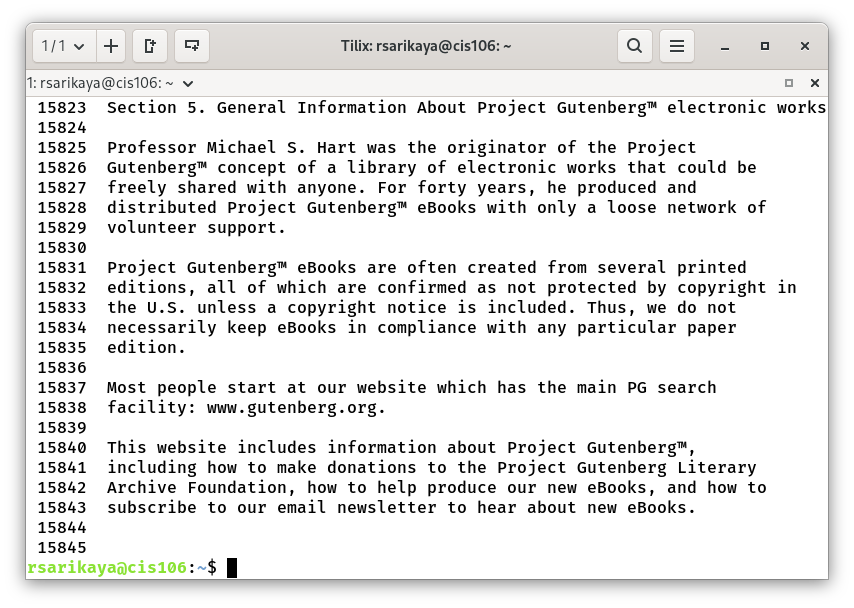

### Practice 2
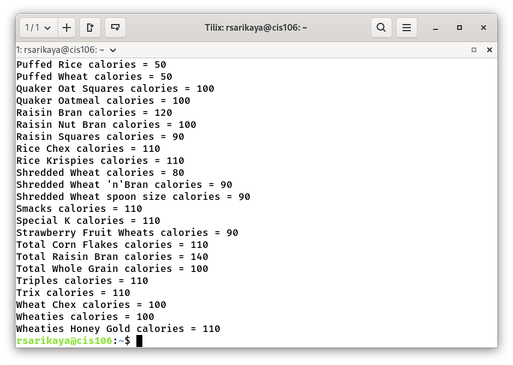

### Practice 3
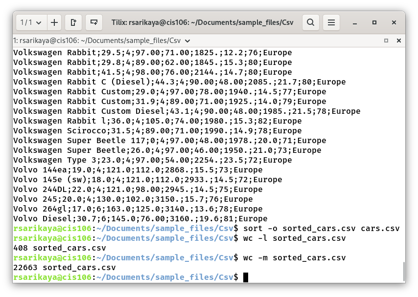

## Challange Questions

### 1 Before we start working with the log file, figure out How many logs the file contains.
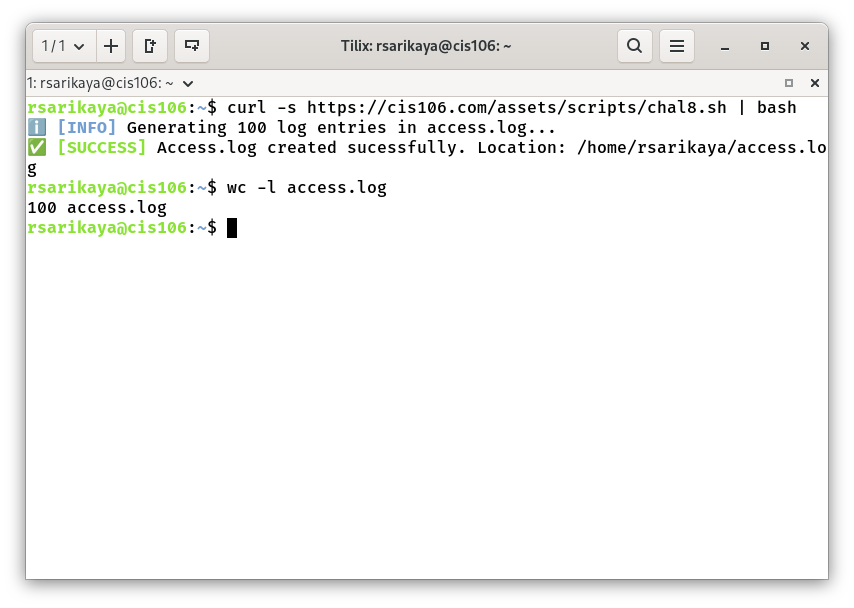

### 2 Who was the first user to interact with the application?
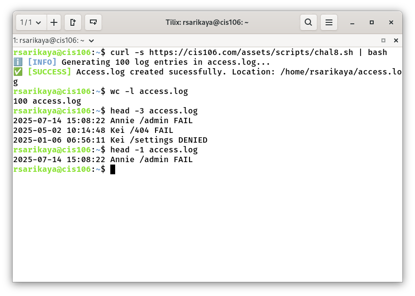

### 3 Who was the last user to interact with the application?
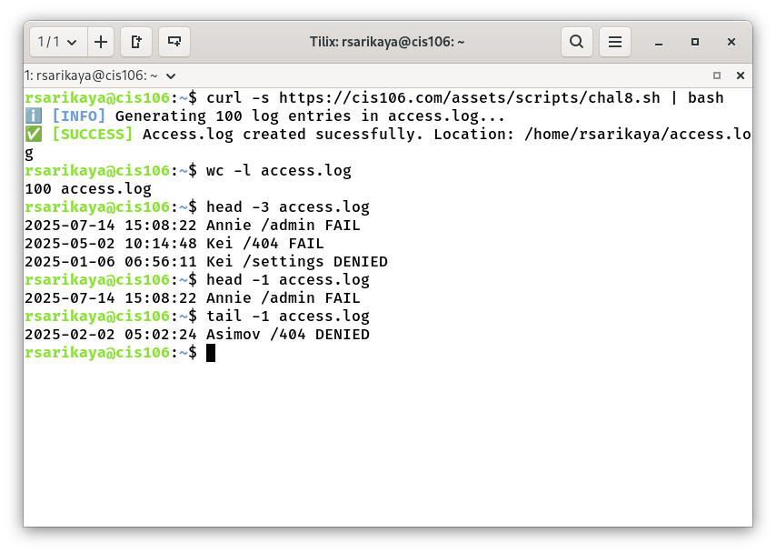

### 4 What are the first 15 events in the file? You must include the name of the file in the command output.
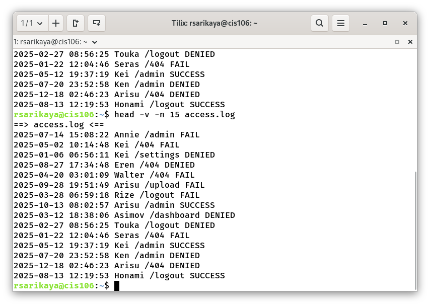

### 5 What are the last 15 events in the file? You must include the name of the file in the command output.
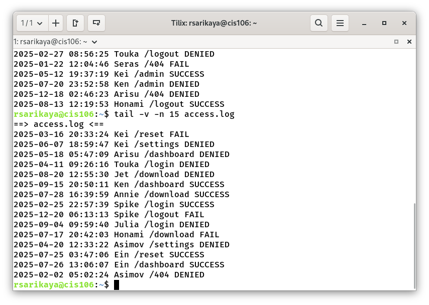

### 6 Your boss needs a list of every user who logged an event. Generate the list using the file access.log. You only need to display the list in the terminal. There is no need to save the output or deleting the duplicates. Simply extract the usernames from the access.log file.

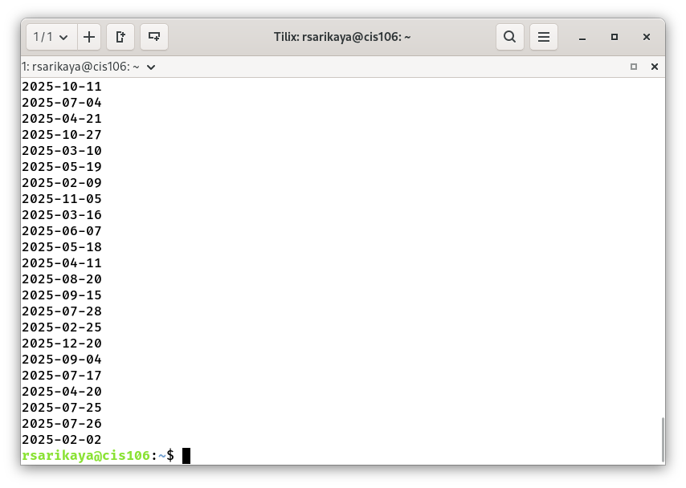

### 7 Your boss needs you to order the logs alphabetically by username and save the output in a file called: sorted_access_log_by_uname.log.
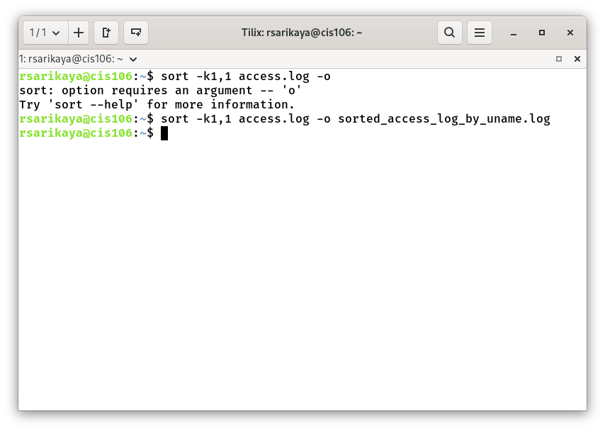

### 8 Your boss needs you to order the logs alphabetically by endpoint used and save the output in a file called: sorted_access_log_by_endpoint.log.
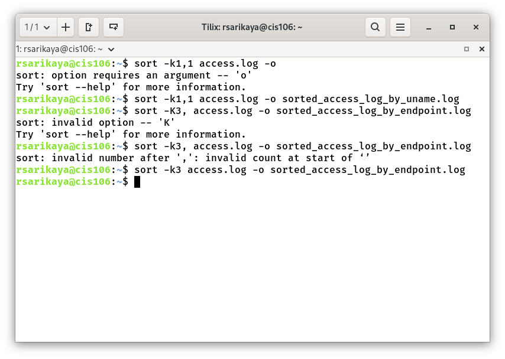

### 9 You need to get a more clear idea of what action each user did in the application. Manipulate the access.log file
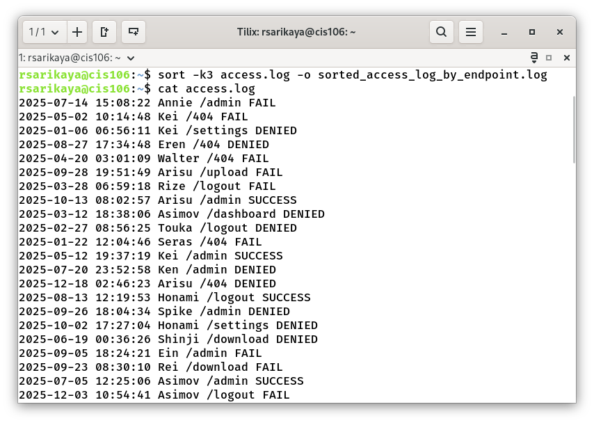
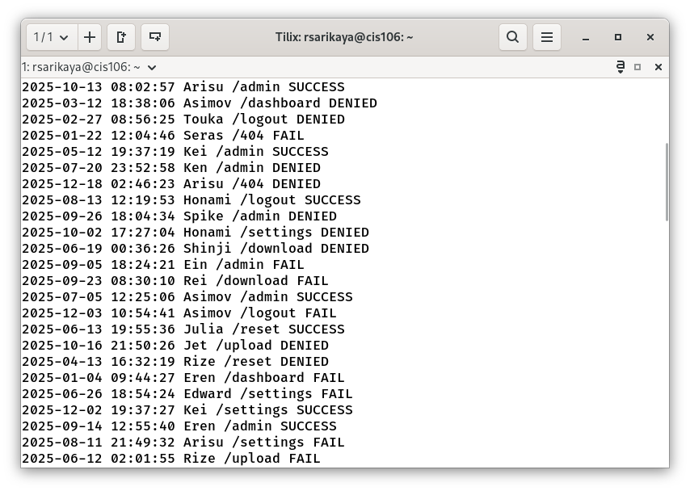
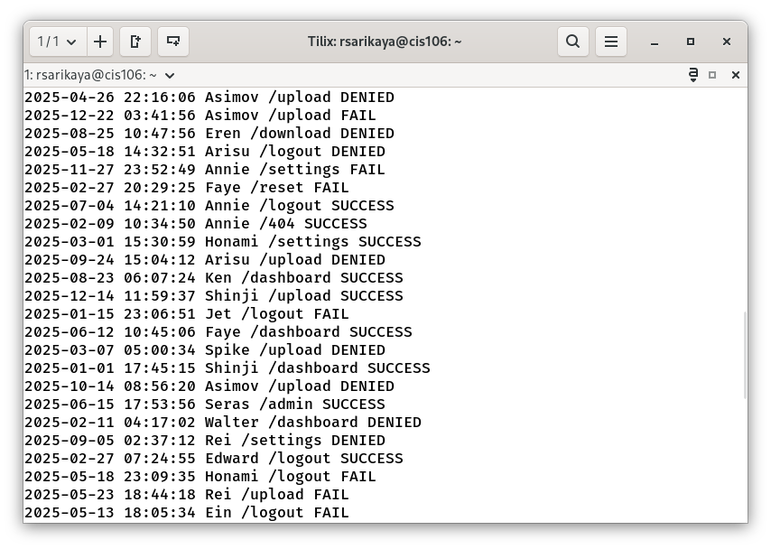
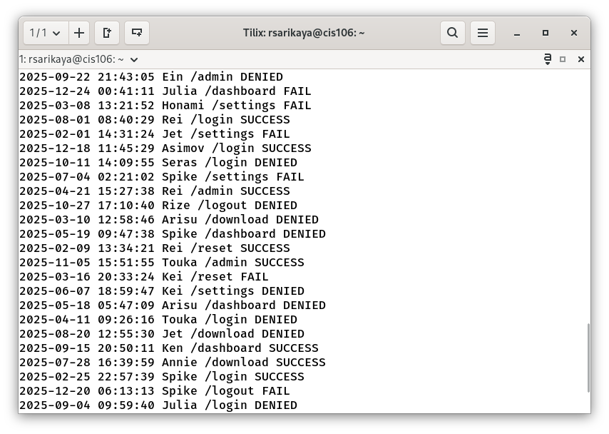
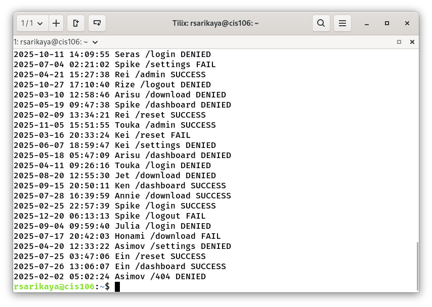

