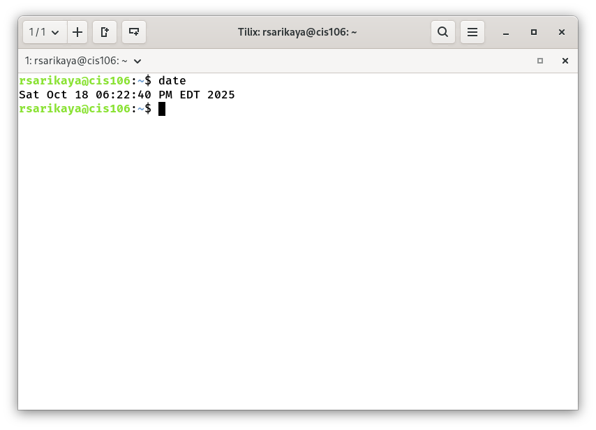
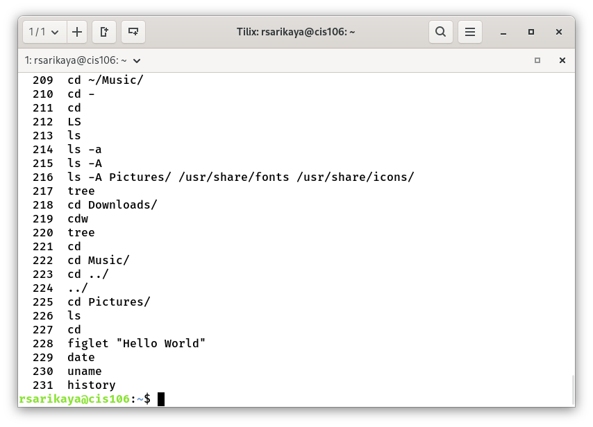
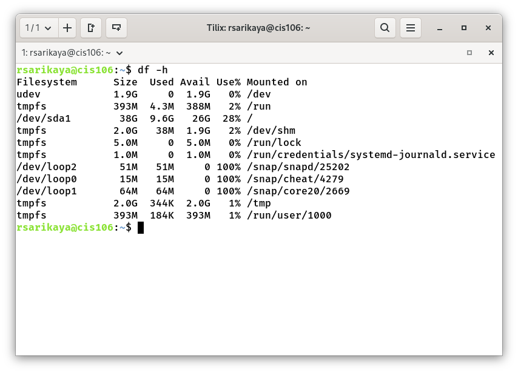
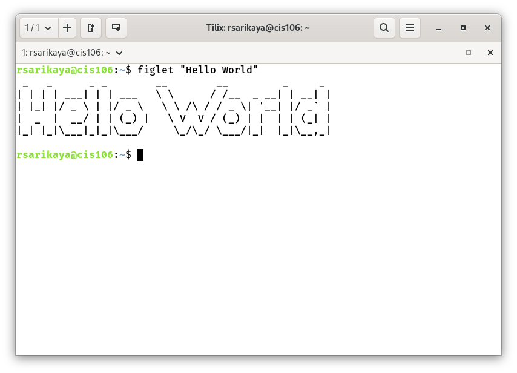

# Notes 3

## What is a graphical user interface (GUI)?

-  graphical user interface (GUI) is a visual way for users to interact with a computer or device usinggraphical elements like icons, buttons, menus, and windows, rather than typing text commands.

## What is a desktop environment?

- A desktop environment is the graphical user interface (GUI) you use to interact with a computer,providing icons, menus, toolbars, and a window manager for managing windows.

## What is the command line interface (CLI)?

- command-line interface (CLI) is a text-based way to interact with a computer by typing commands into a terminal instead of a mouse and icons like in a graphical user interface (GUI).
## How do I access the command line interface (CLI)?

- You can access the command line interface (CLI) by using a keyboard shortcut to open the search barand typing cmd (Windows) or Terminal (macOS), or by using the Ctrl + Alt + T shortcut on Linux. OnWindows, you can also press Windows + R, type cmd, and press Enter.

## What is a virtual console?

- A virtual console is a service that emulates older video game consoles to allow users to play classicgames on modern hardware. 

## What is a terminal emulator?

- A terminal emulator is a software program that recreates the functionality of a physical terminal,allowing a user to interact with a command-line interface 
(CLI) from within a modern operating system.

## What is bash?

- Bash, short for Bourne-Again Shell, is a command-line interpreter that allows users to interact with aUnix-like operating system by typing commands

## What is the shell prompt?

- A shell prompt is the line of characters that appears on a command-line interface, indicating that theshell is ready to accept user commands and displaying information like the username, hostname, and current directory,

# Definition, usage, and examples of the following commands:

## clear
- **Definition:** Clear the terminal screen
- **Usage:** 'Clear'
- **Example:** How to clean the terminal 'Clear'

## echo
**Definition:** The echo command in Linux is a built-in command that allows users to display lines of textor strings that are passed as arguments. It is commonly used in shell scripts and batch files to outputstatus text to the screen or a file.
- **Usage:** echo [string]
- **Example:** echo "Geeks for Geeks"

## date
- **Definition:**  print or set the system date and time
- **Usage:** -d, --date=STRING display time described by STRING, not 'now'
- **Example:**  'Date'

## free
- **Definition:**  Display amount of free and used memory in the system
- **Usage:** free [options]
- **Example:** 'Free`

## uname
- **Definition:** Print system infortmation
- **Usage:** uname [OPTION]
- **Example:** How to print system information 'uname`

## history
- **Definition:** Print the command history in terminal
- **Usage:** `history`
- **Example:** how to print previous commands in linux.

## man
- **Definition:** The man command in Linux is used to display the manual pages (man pages) forcommands, system calls, library functions, and configuration files. It provides comprehensive
- **Usage:** man (command name)
- **Example:** To view the manual page for the ls command: man ls

## tldr
- **Definition:** The tldr command in Linux provides simplified, community-maintained documentation forcommand-line utilities, offering practical examples of common usage instead of the extensive detailsfound in traditional man pages. It is particularly useful for quick reference and understanding how touse a command effectively with common scenarios.
- **Usage:** To get a tldr page for a specific command, simply type tldr followed by the command name: tldr <command_name>
- **Example:**  to see common usage examples for the ls command: `tldr ls`

## cheat
- **Definition:**  The cheat command in Linux is a command-line utility that provides quick and interactivecheat sheets for various commands and topics. It is designed to offer a concise reference forcommands you might not use frequently, saving you from consulting lengthy man pages.
- **Usage:** o view the cheat sheet for a specific command, use the following syntax: cheat <command_name>
- **Example:** To see the cheat sheet for the ls command: `cheat ls`

## hostname
- **Definition:** The hostname command in Linux is a utility used to display or set the system's hostname,which is a unique identifier for a device on a network. It also provides options to retrieve other network-related information.
- **Usage:** Display current hostname. `hostname`
- **Example:** o check the current hostname, you would simply type: hostname

## df
- **Definition:** The df command in Linux, short for "disk free," is used to display the amount of availableand used disk space on mounted file systems. It provides a summary of disk space usage, includingtotal size, used space, available space, percentage of usage, and the mount point for each file system.
- **Usage:** Report file system space usage
- **Example:**  This command displays disk space usage for all mounted file systems in 1K blocks bydefault. human-readable format. `df -h`

## du
- **Definition:** The du (disk usage) command in Linux is used to estimate and summarize the disk spaceused by files and directories. It is a fundamental tool for managing disk space and identifying large filesor directories that might need attention.
- **Usage:** The basic syntax for the du command is:du [OPTION]... [FILE]...
- **Example:** Check disk usage of the current directory in human-readable format: `du -h` 

## figlet
- **Definition:** The figlet command in Linux is a utility used to create large ASCII art banners from ordinarytext. It is a powerful tool for generating decorative text for various purposes, such as shell scripts, motd(message of the day) files, or READMEs
- **Usage:** To use figlet, simply type figlet followed by the text you want to convert
- **Example:** figlet `Hello World`

