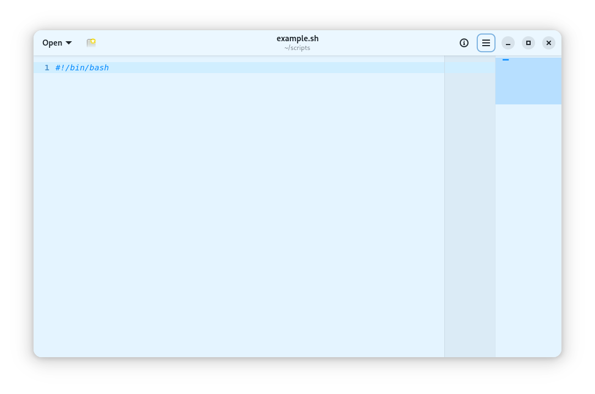
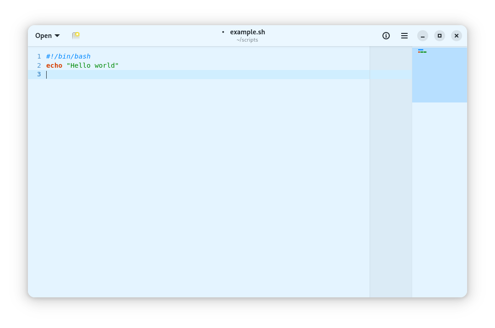
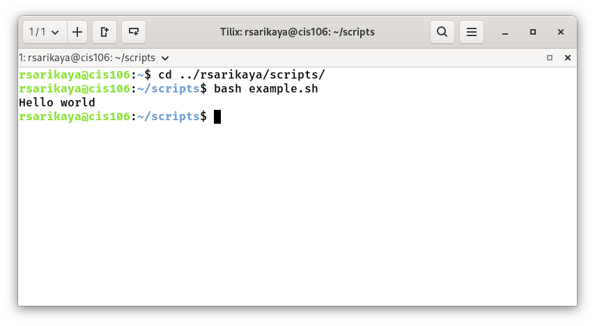

# Notes 4

## How to install and remove software using the APT command
- The Advanced Package Tool (APT) is a powerful command-line tool used in Debian-based Linux distributions (like Ubuntu) to manage software packages.
  - Installing Software with APT:
  - `sudo apt install [package_name]`
  - Removing Software with APT:
  - `sudo apt remove [package_name]`

## How to create a shell script 

### Step 1 Create the file and add the shell decleration
- When creating a shell script, it needs to be coded in the shell. In linux, gnome text editor is the perfect place to create a shell script. To create a file for shell script, just open the text editor and give it a name and .sh file extension at the end and then simply add the shell decleration  `#!/bin/bash` 

### Step 2 Add the code
- After creating the file and naming the script, script has to include a code to be able to run the script properly. The code in the example is echo command and it basically prints the text on the screen.

### Step 3 Run the script
- In order to run the script, go to the terminal and navigate to the directory that contains the script. After finding the directory that contains the script, simply use the bash command as in the example.

