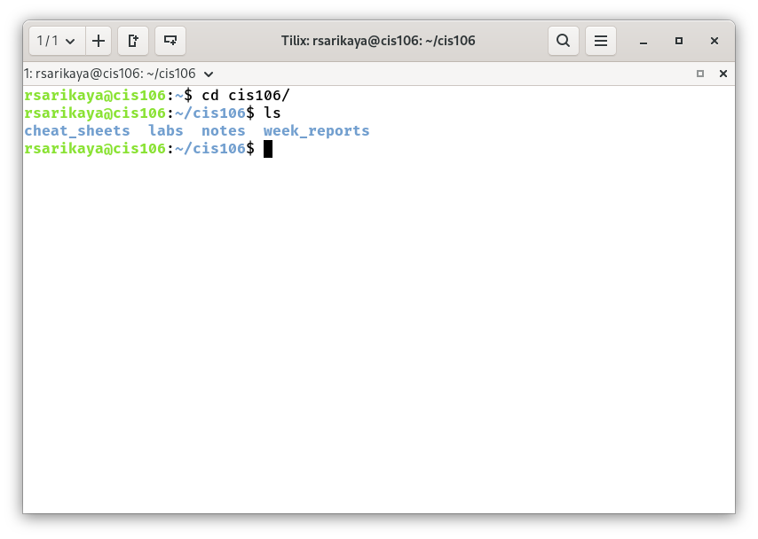
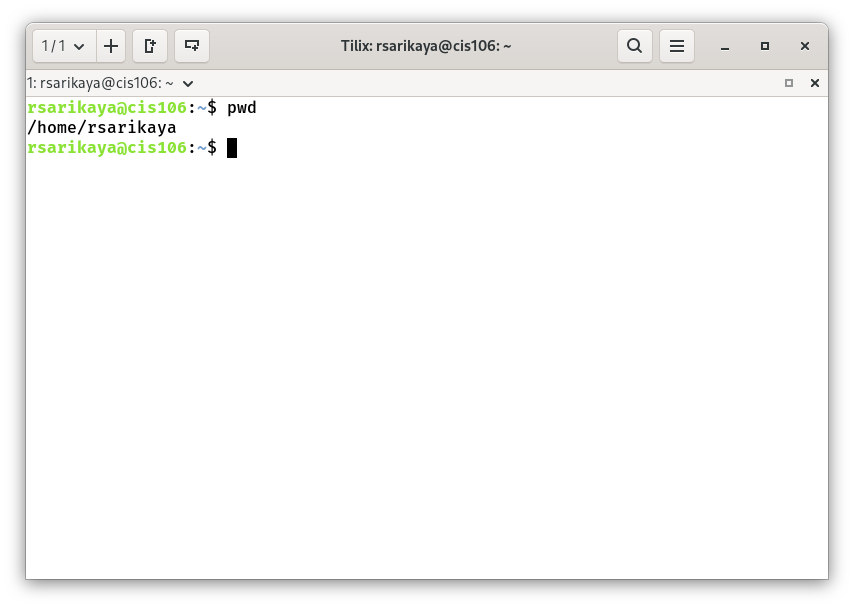
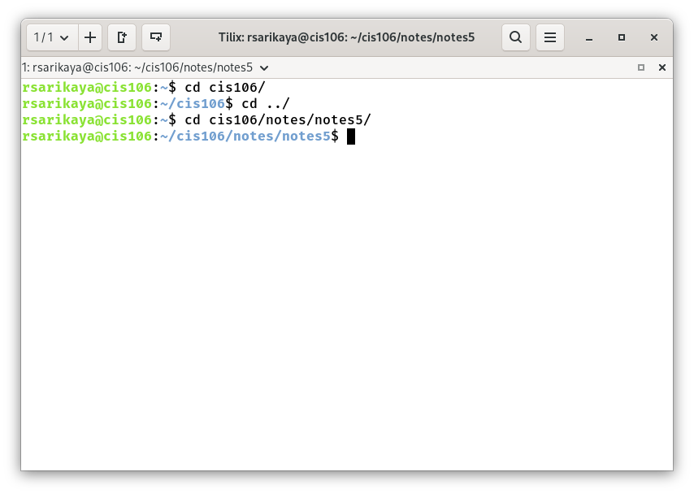

# Notes 5

## Commands for navigating the file system:

## ls
### Usage
* ls is used for listing files and directories. By default it will list the current directory when no directory is specified. Listing means to see what is inside a directory.
### Formula
* `ls + option + directory to list`
### Examples
* See all the options of the ls command (extracted from the man page):
  * `ls --help`
* List the current directory:
  * `ls` 
* List all the files including hidden files in current directory:
  * `ls -A`

## pwd
### Usage
* Print the name of the current working directory. 
# Formula
  * `pwd`
### Examples
* Print the absolute path of current working directory 
  * `pwd`

## cd
### Usage
* Changes the current working directory. In other words, it moves you from one directory to another. By default, it will always send you to your home directory.
### Formula
  * `cd + destination absolute path or relative path`

### Examples
* Change the current directory in shell.
  * `cd cis106/notes/notes5/`
* 

### What is a variable?
* A variable is a named container that stores a value. Think of it like a labeled box. The label is the variable's name, and whatever you put inside the box is its value. This value can be text, a number, a file path, or other types of data. The power of a variable is that you can refer to its name in a script or command, and the system will use the value stored inside it. 
### How do I use a variable?
* Using a variable typically involves two steps: setting it and referencing it.
  - Setting a Variable: You assign a value to a name.
    -  In Linux/macOS Bash: my_name="Alice"

  - Referencing a Variable: You use the variable's name to retrieve its value. This is often called "variable expansion."
    - In Linux/macOS Bash: Use the $ symbol. echo $my_name will output Alice.

### What is an environment variable?
* An environment variable is a special type of variable that is set in the shell (command-line environment) and is inherited by any programs or scripts that you start from that shell. They are used to configure the system's behavior and provide information to running processes.
  
### What is a user defined variable?
* A user-defined variable is any variable that you, the user, create in your script or command-line session for your own purposes. They are typically temporary and only available in the session or script where they were created.

### What is the root directory?
* The root directory is the top-most directory in a file system hierarchy. It is the starting point from which all other files and directories branch out. It is represented by a single forward slash (/).
  * On Linux and macOS: The entire file system has one root directory: /.
  
### What does “Parent Directory” mean?
* The parent directory is the directory that contains the current item (which could be a file or another directory). In a path, it is the directory one level up in the hierarchy.

  * Example: If the path is /home/user/Documents/report.txt, then the parent directory of report.txt is Documents. The parent directory of Documents is user.
### What does “Current working directory” mean?
* he current working directory (often abbreviated as CWD) is the directory in which you are currently working in your command-line terminal. Any commands you run (like creating a file or listing files) will be executed in the context of this directory, unless you specify a full path.

  * Command to check it: pwd (Linux/macOS/PowerShell) or cd (Windows Command Prompt).
  * 
### What is an absolute path? Include an example
* An absolute path is the full, unambiguous address of a file or directory, starting from the root directory (/). It always points to the same location, regardless of your current working directory.

  * Example: /home/alice/Pictures/vacation.jpg

    * It starts from the root (/).

    * It specifies every directory leading to the file.

    * You can use this path from anywhere in the system to uniquely identify vacation.jpg.

### What is a relative path? Include an example
* A relative path is a path that is relative to your current working directory. It does not start with a root directory (`/` or `C:\`). It uses special symbols:

  * `.` (a single dot): Represents the current directory.

  * `..` (two dots): Represents the parent directory.
  * Example: Let's say your current working directory is `/home/alice`.

      *  The relative path to `vacation.jpg` would be: `Pictures/vacation.jpg` or `./Pictures/vacation.jpg`.

       * To go up one level to the `/home` directory, you would use `..`.

### What is the difference between “Your home directory” and “The home directory”?
* "Your home directory": This refers specifically to the home directory of the user who is currently logged in. It's a personal workspace for that user.
  * Path: On Linux/macOS, it's typically /home username or /Users/username. On Windows, it's C:\Users\Username.
  * In Command Line: It is often represented by the tilde symbol (~). The command cd ~ will always take you to your home directory.

* "The home directory": This is a more general term that can be ambiguous without context. It could mean:

  1. The same as "your home directory."

  2. The home directory of another specific user (e.g., "the home directory of the website's server user is /var/www").

  3. The concept of a home directory in general.

* In summary: "Your home directory" is personal and specific to you. "The home directory" is a generic term that needs context to be precise. In most casual conversations, they are used interchangeably to mean your home directory.    "Your home directory": This refers specifically to the home directory of the user who is currently logged in. It's a personal workspace for that user.
