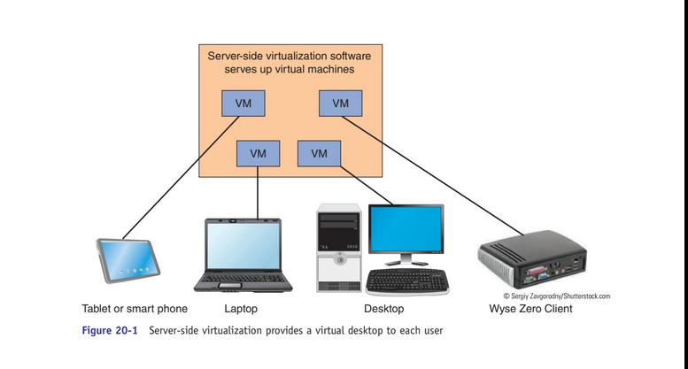
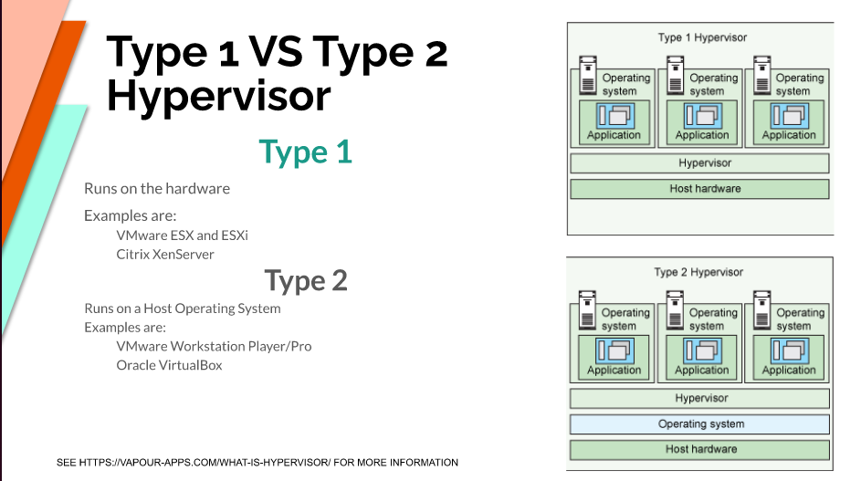
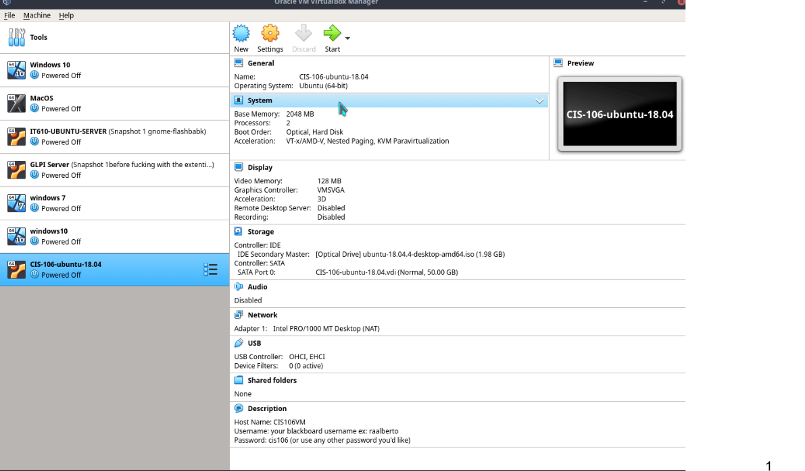
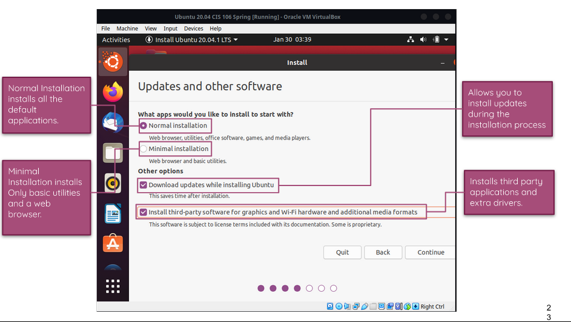
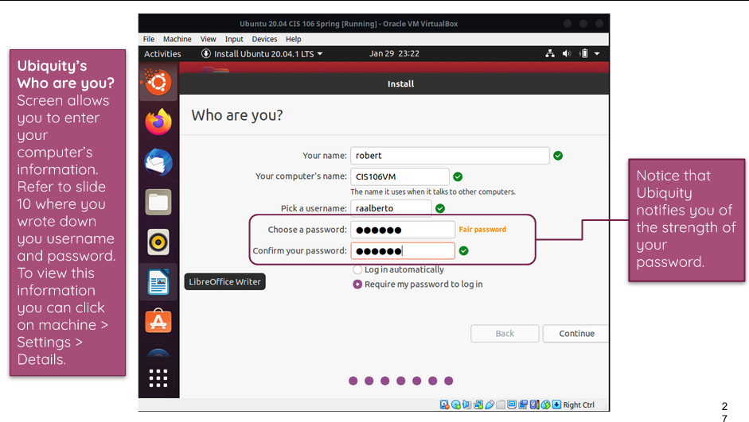
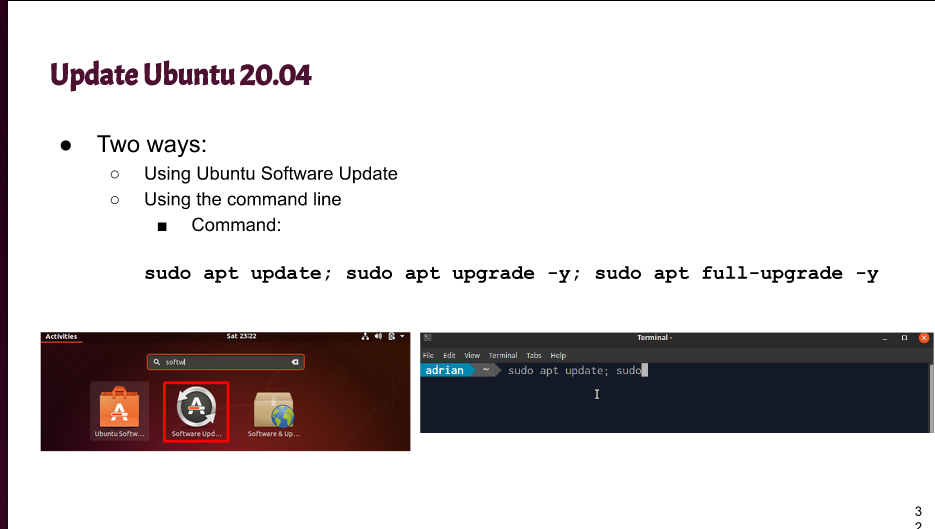
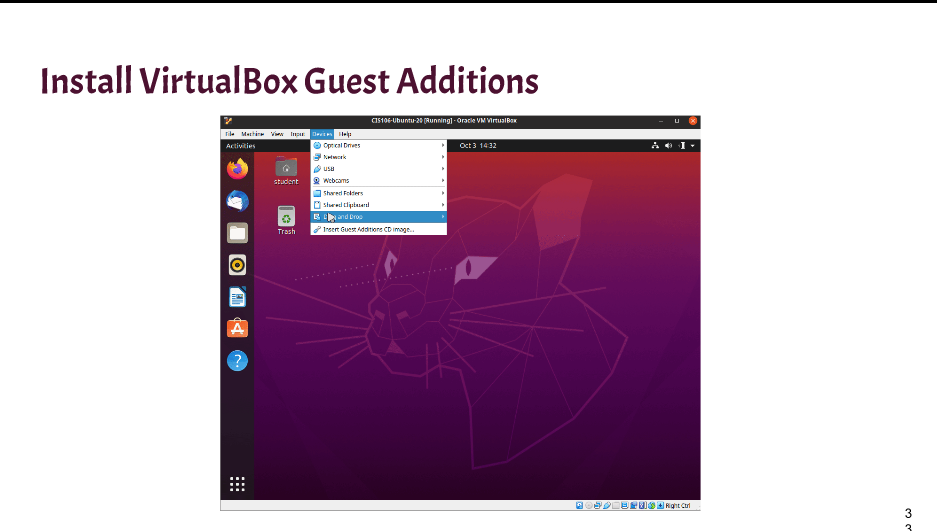

# Week report 2

## The basics of virtualization

1. **What is virtualization**
Definition of virtualization; Replication of hardware to simulate a virtual machine inside a physical machine.

2. **Types of virtualization**
   **1.Server-side virtualization**
   Definition: Server virtualization is the process of dividing a physical server into multiple unique and isolated virtual servers by means of a software application.

    

   **2.Client-side virtualization**
   Definition: Client virtualization is a virtual machine (VM) environment in the user's machine

 

## Installing ubuntu in Virtualbox 

 

