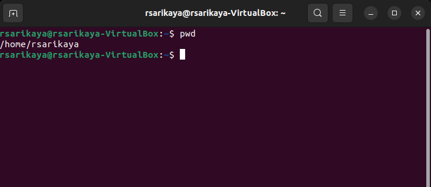
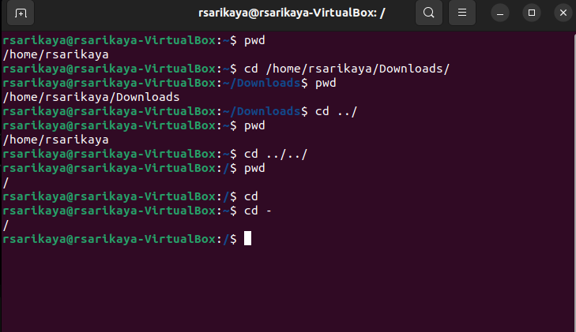
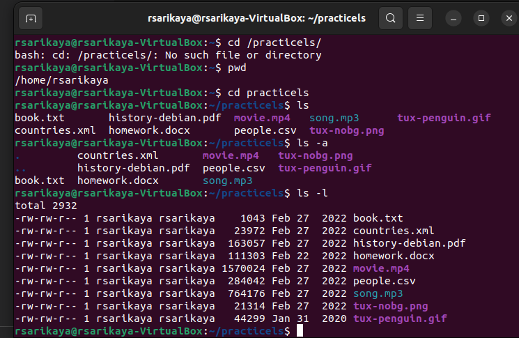
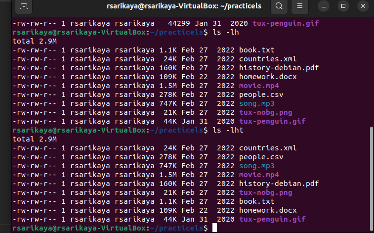
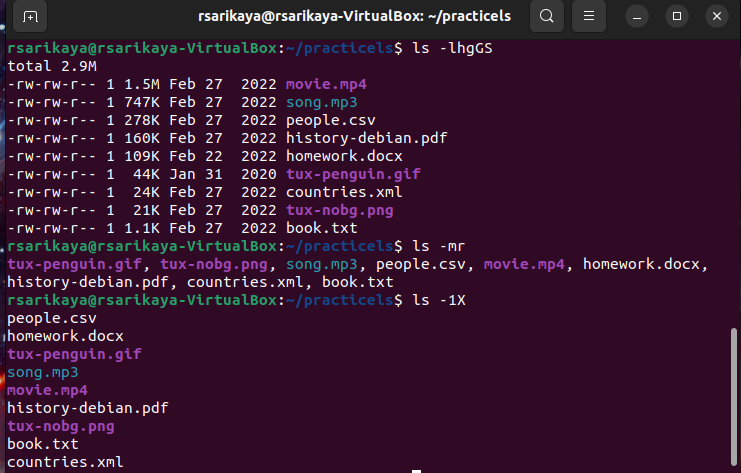

# Week Report 4

## Practice

## The Filesystem (Some important Directories)

| Directory | Data Stored in Directory                                                                                                                |
| --------- | --------------------------------------------------------------------------------------------------------------------------------------- |
| bin       | Essential commands                                                                                                                      |
| dev       | Device flies                                                                                                                            |
| etc       | System configuration files                                                                                                              |
| home      | User home directories                                                                                                                   |
| media     | Mount point for removable media, such as DVDs and floppy disks                                                                          |
| opt       | Add-on software packages                                                                                                                |
| proc      | Kernel information, process control, system hardware information                                                                        |
| srv       | Information relating to services that run on the system                                                                                 |
| usr       | Software not essential for system operation, such as applications                                                                       |
| var       | Dedicated to variable data, such as logs,databases,websites,and temporary spool(e-mail etc)files that persist from one boot to the next |

## Commands the navigate the filesystem

| command | What it does                                                      | Syntax | Example |
| ------- | ----------------------------------------------------------------- | ------ | ------- |
| pwd     | prints current working directory                                  | 'pwd'  | 'pwd'   |
| cd      | change the current working directory in various operating systems | 'cd'   | 'cd'    |
| ls      | lists the contents of your current working directory              | 'ls'   | 'ls'    |

## Key Terms

  *Definitions of the following term*

 - **File system:**   stores and organizes data and can be thought of as a type of index for all the data contained in a storage device.
 - **Current directory:** To determine the exact location of the current directory at a shell prompt and type the command pwd. This example shows that you are in the user's directory, which is in the /home/ directory. The command pwd stands for print working directory.
 - **parent directory:** A parent directory is a directory that is above another directory in the directory tree
 - **the difference between your home directory and the home directory:** Your home directory is a directory for a particular user of the system and consists of individual files. However, Root directory is the home directory in the Linux system containing all the files, device data and system information in the form of directories. 
 - **pathname:** a statement of the location of a file or other item in a hierarchy of directories.
 - **relative path:** the location of a file or folder in relative to the current working directory.
 - **absolute path:** the complete details needed to locate a file or folder, starting from the root element and ending with the other subdirectories.
 

 
 - **the commands are used for navigating the filesystem:**
 - **pwd:** print name of current/working directory
 - **cd:**  change directory command.
 - **ls:** List  information  about  the FILEs (the current directory by default).
 