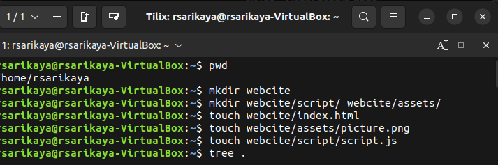
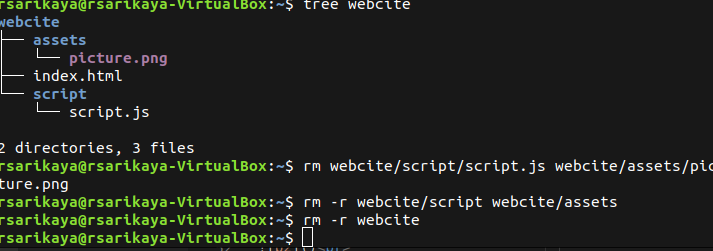
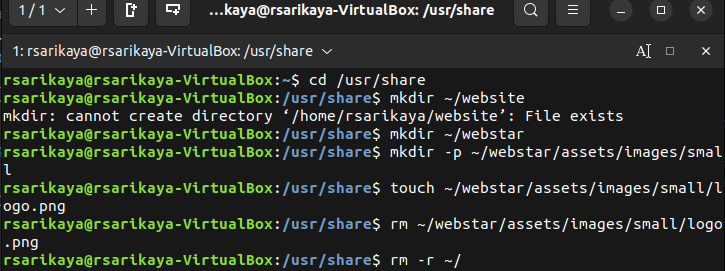
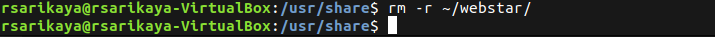

   # Week Report 5

   ## What are Command Options?
   - Commands are often followed by options that modify/enhance their behavior. **"command -option argument"**
   ## What are Command Arguments?
   - Commands are also followed by arguments which are the items open which the command acts on. **" ls -l ~/Downloads"**
   ## Which command is used for creating directories? Provide at least 3 examples.
   - **mkdir** is used for creating a single directory or multiple directories. To create a directory with **mkdir** type: **mkdir+ the name of the directory.**
   - *Example:*
   - To create a directory in the present working directory -- **mkdir wallpapers** 
   - To create a directory in a different directory using relative path -- **mkdir wallpapers/ocean**
   -

   ## What does the touch command do? Provide at least 3 examples.
 *touch* is used for creating files 
   - ***Note: Creating files is not the designed purpose of te touch command. The touch command updates any given file's timestamp. But, if the file does not exist, it creates it.***
   - *Example:*
   - To create a file called list: **touch list**
   - To create a file using absolute path: **touch ~/Downloads/games.txt**
   - to create a file with a space in its name: **touch "list of foods.txt"**
   ## How do you remove a file? Provide an example.
   - **rm** removes files. **rm** by default does not removes directories. To remove a directory use **rm** with the **-r** option. 
   - Example: 
   - To remove a file
  **rm list**
   

   ## How do you remove a directory and can you remove non-empty directories in Linux? Provide an example
   - To remove empty 
   directories use the **rmdir** command.
   - To remove an empty directory 
  **rmdir Downloads/games**
   - To remove non empty directories use **rm -r** + directory name or directory absolute path.
  **rm -r Downloads/games**
   
   ## Explain the mv and cp command. Provide at least 2 examples of each
  - **mv** moves and renames directories. The basic formula of the mv command is: **mv + source + destination 
- For renaming files/directories the formula remains the same: **mv + file/directory to rename + new name**
- To copy a file: **cp Downloads/wallpapers.zip Pictures/**
- To copy a directory with absolute path: **cp -r ~/Downloads/wallpapers ~/Pictures/**

## Practice
- Practice 1
 
 
- Practice 2
 
 
- Practice 3 
 
- Practice 4
 