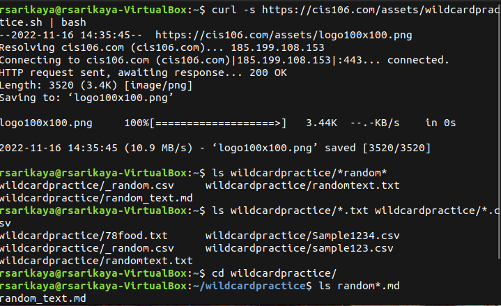
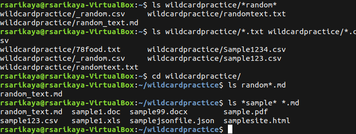
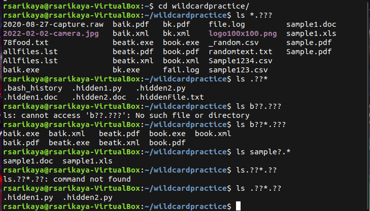
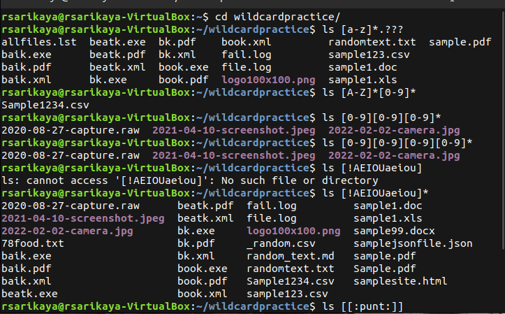
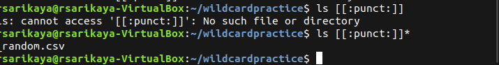

# Week Report 6

## Wildcards.

### * Wildcard

* A star alone matches anything and nothing and matches any number of characters.
* Examples:
    * lists all the text files in a directory
      * `ls *.txt` 
    * list all the files that start with the word file
      * `ls file*`
    * Copy all the mp4 files
      * `cp Downloads/*.mp4 ~/Videos/Movies/`

### ? Wildcard
* The ? wildcard metacharacter matches precisely one character.
*  Examples:
    * lists all the files in the current directory
        * `ls`
    * list all the hidden files in the current directory
       * `ls ./.??`
    * list all the files that have a 3 letter file extension.
      * `ls *.???`
  

### [] wildcard
* The brackets wildcard match a single character in a range.
  * Examples: 
    * to match all files that have a vowel after letter f:
      * `ls f[aeiou]*`
    * to match all files whose name has at least one number: 
      * `ls[0-9]*`
    * to match all files that have a range of letters after f:
      * `ls f[a-z]*`
### Brace expansion
* Brace expansion {} is not a wildcard but another feature of bash that allows you to generate arbitrary strings to use with commands.
  * Examples:
    * To create a whole directory structure in a single command:
      * `mkdir -p music/{jazz,rock}/{mp3files,videos,oggfiles}/new{1..3}`
    * Remove multiple files in a single directory:
      * `rm -r {dir1,dir2,dir3,file.txt,file.py}`
    * To create a N number of files use:
      * `touch website{1..5}.html`
      * `touch file{A..Z}.txt`
  
## Practice
  *  Practice 5:
  
  
  *  Practice 6:
  
  *  Practice 7:
  
  
  