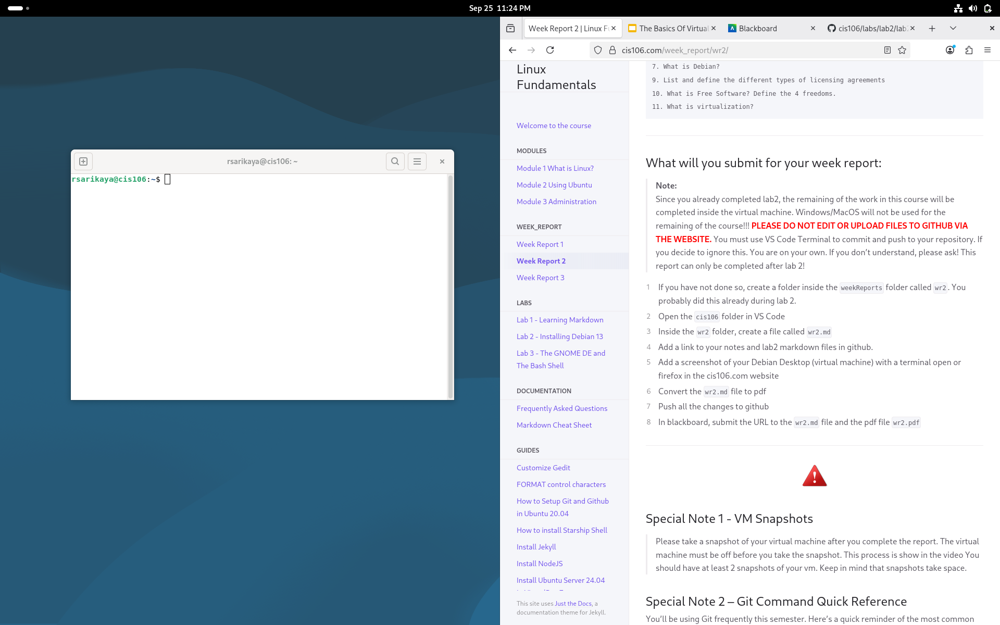

# Week Report 2

## Alternative 1 using the local path way

* [notes2](../../notes/notes2/notes2.md)  
* [lab2](../../labs/lab2/lab2.md)
  
## Alternative 2 using the github path url

* [notes2](https://github.com/rsarikaya26/cis106/blob/main/notes/notes2.md)  
* [lab2](https://github.com/rsarikaya26/cis106/blob/main/labs/lab2/lab2.md)
  
## Debian Desktop Screenshot

