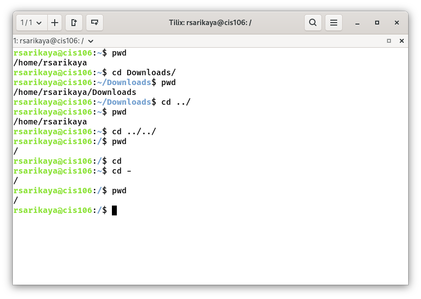
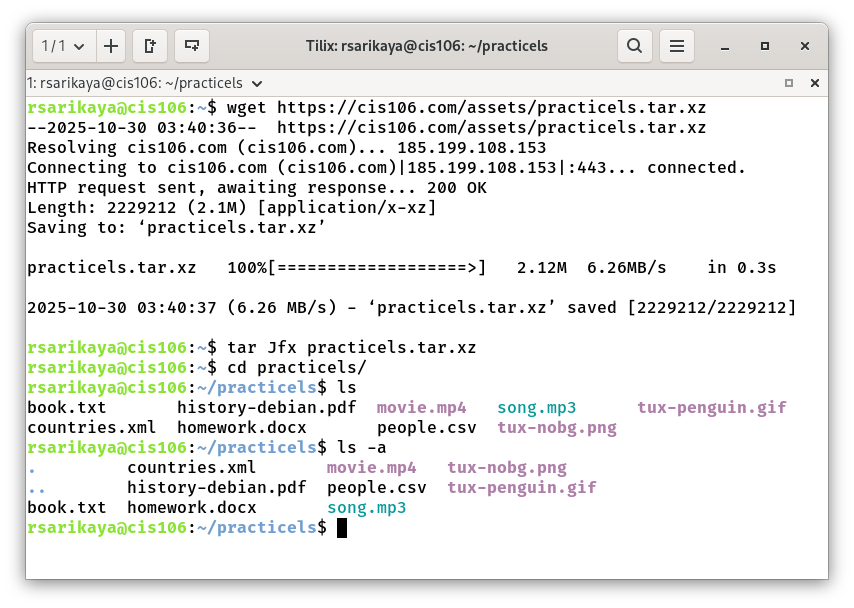
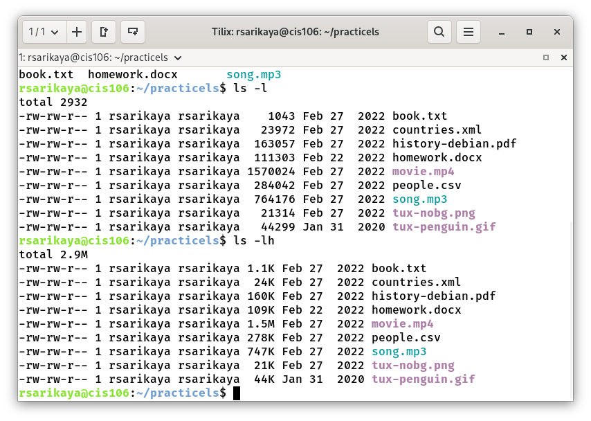
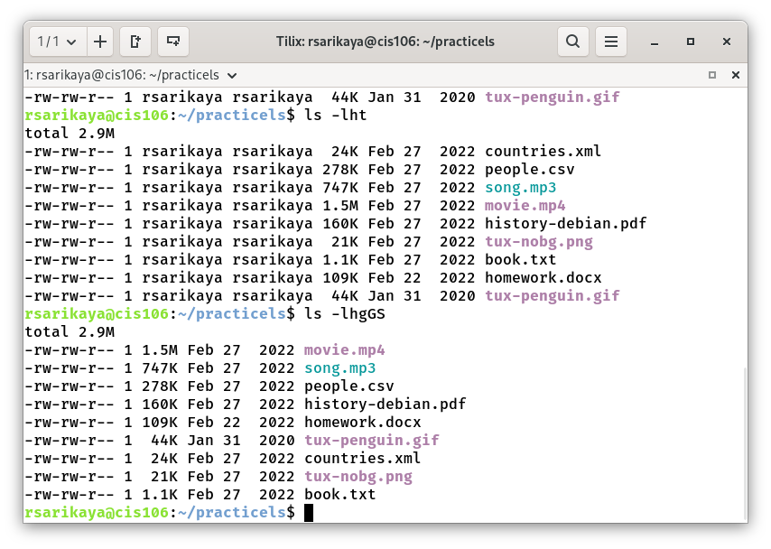
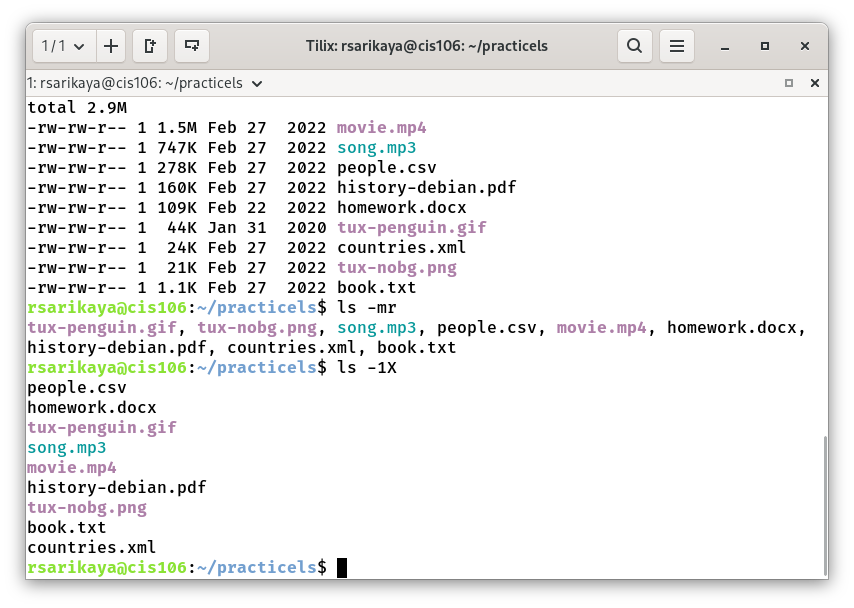
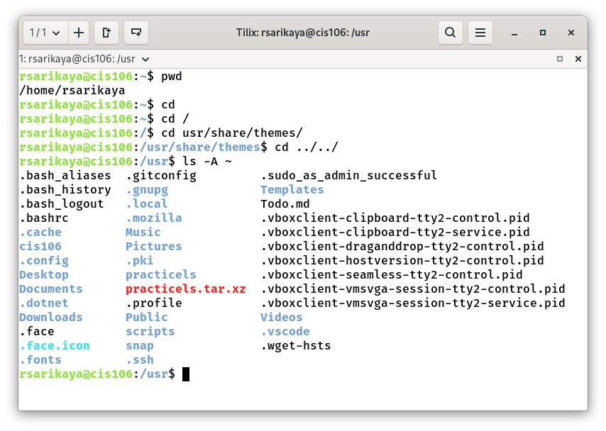
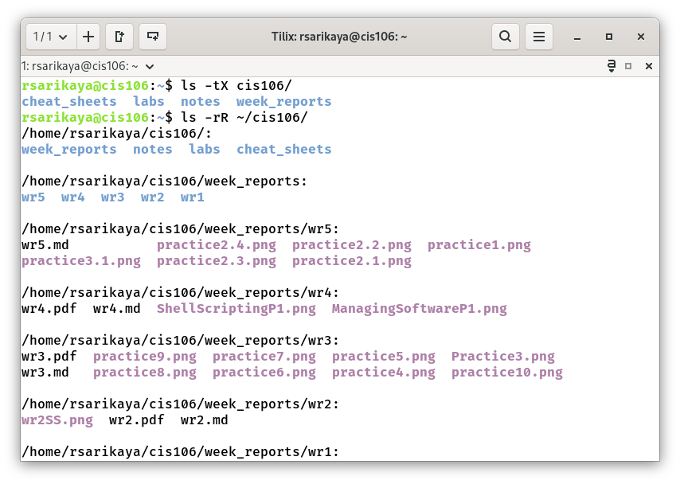
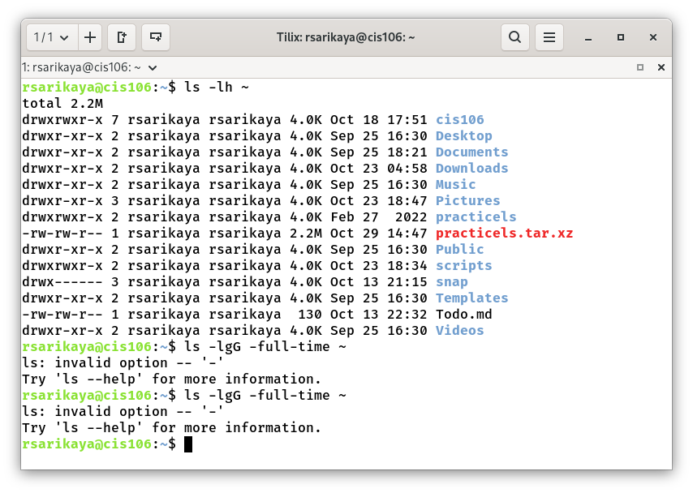
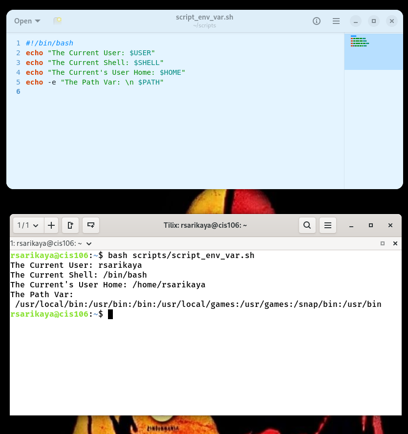
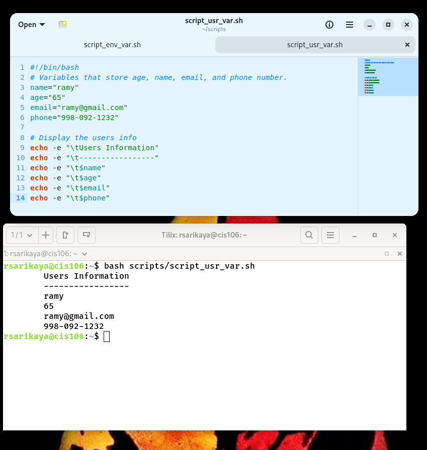

# Week Report 5

## Practices

## The linux Filesystem:
### Practice 1

### Practice 2

### Practice 3

## Shell Scripting Chapter 2:
### Practice 2

### Practice 3
* 

## Links
* [Lab5](../../labs/lab5/lab5.md)
* [Notes5](../../notes/notes5/notes5.md)

